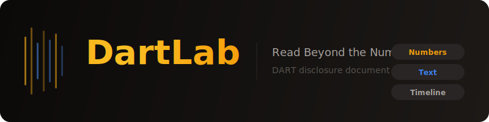

<div align="center">

<br>

<picture>
  <source media="(prefers-color-scheme: dark)" srcset=".github/assets/hero.svg">
  <source media="(prefers-color-scheme: light)" srcset=".github/assets/hero.svg">
  
</picture>

<br>

<h3>DART 공시 문서를 완벽하게 분석하는 Python 라이브러리</h3>

<p>


</p>

<p>
<a href="https://pypi.org/project/dartlab/"></a>
<a href="https://pypi.org/project/dartlab/"></a>
<a href="LICENSE"></a>
</p>

<br>

<p>
<a href="https://eddmpython.github.io/dartlab/">문서</a> ·
<a href="https://eddmpython.github.io/dartlab/docs/">API Reference</a> ·
<a href="https://github.com/eddmpython/dartlab/releases/tag/data-v1">샘플 데이터</a> ·
<a href="https://buymeacoffee.com/eddmpython">Buy Me a Coffee</a>
</p>

</div>

---

## 문제

DART에는 수십만 건의 공시가 있다.

대부분의 도구는 여기서 **매출, 영업이익** 같은 숫자 몇 개만 뽑아간다.
나머지 99%의 정보 — 사업의 내용, 위험 요인, 감사의견, 소송 현황, 지배구조 변동 — 는 버려진다.

공시의 숫자만 보는 건, 책의 목차만 읽는 것과 같다.

## 해법

DartLab은 DART 공시 문서를 **통째로** 분석한다.

```
기존 도구         DartLab
─────────         ──────────────────────
매출액 ✓          매출액 ✓
영업이익 ✓        영업이익 ✓
순이익 ✓          순이익 ✓
                  사업의 내용 ✓
                  위험 요인 ✓
                  감사의견 ✓
                  소송 현황 ✓
                  지배구조 변동 ✓
                  특수관계인 거래 ✓
                  텍스트 변경 추적 ✓
                  정량·정성 교차 검증 ✓
```

**숫자는 결과이고, 텍스트는 원인이다.** DartLab은 둘 다 읽는다.

## 핵심 개념: 공시 수평 정렬

DART 공시는 보고서 유형별로 잘려 있다:

```
         Q1        Q2        Q3        Q4
         ─────     ─────     ─────     ─────
1분기    ████░░░░░░░░░░░░░░░░░░░░░░░░░░
반기     ████████████░░░░░░░░░░░░░░░░░░
3분기    ██████████████████████░░░░░░░░░
사업     ████████████████████████████████
```

DartLab은 이 조각들을 **시계열로 정렬**하여 하나의 연속된 흐름으로 만든다.
숫자도, 텍스트도 — 모두 같은 시간축 위에 놓는다.

## 세 가지 분석 레이어

### Layer 1 — 정량 분석 (Bridge Matching)

누적 재무제표에서 개별 분기 실적을 역산한다.

```python
from dartlab.finance.summary import analyze

result = analyze("data/docsData/005930.parquet")
result.dataframe  # 계정명 × 연도 시계열 DataFrame (Polars)
```

| 기능 | 설명 |
|------|------|
| **분기 역산** | 누적→단기 변환으로 Q1~Q4 개별 실적 복원 |
| **계정 브릿지** | K-IFRS 개정 등 계정명 변경에도 시계열 연결 |
| **변경점 탐지** | 회계기준 변경(breakpoint) 자동 감지 |

### Layer 2 — 정성 분석 (텍스트 시계열)

같은 섹션의 텍스트를 분기별로 정렬하고 변경점을 추적한다.

- "사업의 내용" 섹션이 전 분기 대비 어떻게 바뀌었는지
- 새로 추가된 위험 요인, 삭제된 문장
- 감사의견 변경 시점과 맥락

### Layer 3 — 교차 검증 (숫자 × 텍스트)

정량 변동과 정성 변화를 연결한다.

- 영업이익이 급감한 분기 → 텍스트에서 어떤 설명이 추가됐는가
- 새로운 리스크 문장이 등장한 시점 → 이후 실적에 실제 영향이 있었는가
- 감사의견이 바뀐 시점 → 재무 수치의 신뢰도를 어떻게 판단할 것인가

## 설치

```bash
pip install dartlab
```

```bash
uv add dartlab
```

## 빠른 시작

### 1. 데이터 다운로드

DartLab은 DART 공시 원문을 파싱한 Parquet 파일을 사용한다.
[GitHub Releases](https://github.com/eddmpython/dartlab/releases/tag/data-v1)에서 종목별 파일을 받을 수 있다.

```bash
mkdir -p data/docsData
curl -L -o data/docsData/005930.parquet \
  "https://github.com/eddmpython/dartlab/releases/download/data-v1/005930.parquet"
```

### 2. 요약 재무정보 시계열 추출

```python
from dartlab.finance.summary import analyze

result = analyze("data/docsData/005930.parquet")

# 전체 시계열 — Polars DataFrame
print(result.dataframe)

# 개별 연도 접근
for year in result.years:
    print(f"{year.period}: {len(year.accounts)}개 계정")

# 브릿지 매칭 — 연도 간 계정명 연결
for bridge in result.bridges:
    print(f"{bridge.fromPeriod} → {bridge.toPeriod}: {bridge.matchCount}개 매칭")
```

## 데이터 구조

```
공시 문서 (.parquet)
│
├─ 메타데이터
│  ├── 종목코드, 회사명
│  ├── 보고서 유형 (1분기/반기/3분기/사업)
│  └── 제출일, 사업연도
│
├─ 정량 데이터
│  ├── 요약재무정보 ─── 매출, 영업이익, 자산, 부채 ...
│  ├── 재무제표 본문 ── 상세 계정과목
│  └── 주석 ────────── 세부 내역, 공정가치, 리스 등
│
└─ 텍스트 데이터
   ├── 사업의 내용
   ├── 위험관리 및 파생거래
   ├── 감사의견
   ├── 이사의 경영진단 및 분석
   ├── 임원 현황
   ├── 주주 현황
   └── ...
```

## 기술 스택

| 항목 | 선택 | 이유 |
|------|------|------|
| DataFrame | **Polars** | 고성능, 타입 안전, lazy evaluation |
| 시각화 | **Plotly** | 인터랙티브 차트 |
| 빌드 | **Hatchling** | 순수 Python, 빠른 빌드 |
| 패키지 관리 | **uv** | 빠른 의존성 해결 |

## 로드맵

- [x] 요약재무정보 시계열 추출 (Bridge Matching)
- [ ] 재무제표 본문 상세 파싱
- [ ] 텍스트 섹션 시계열 정렬 및 diff
- [ ] 정량·정성 교차 검증 엔진
- [ ] 시각화 대시보드
- [ ] 랜딩 페이지 및 문서 사이트

## 지원

이 프로젝트가 유용하다면 커피 한 잔 사주세요.

<a href="https://buymeacoffee.com/eddmpython">
  
</a>

## 라이선스

MIT License
